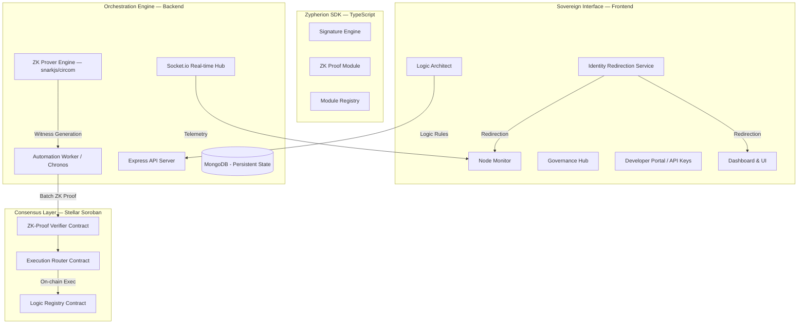
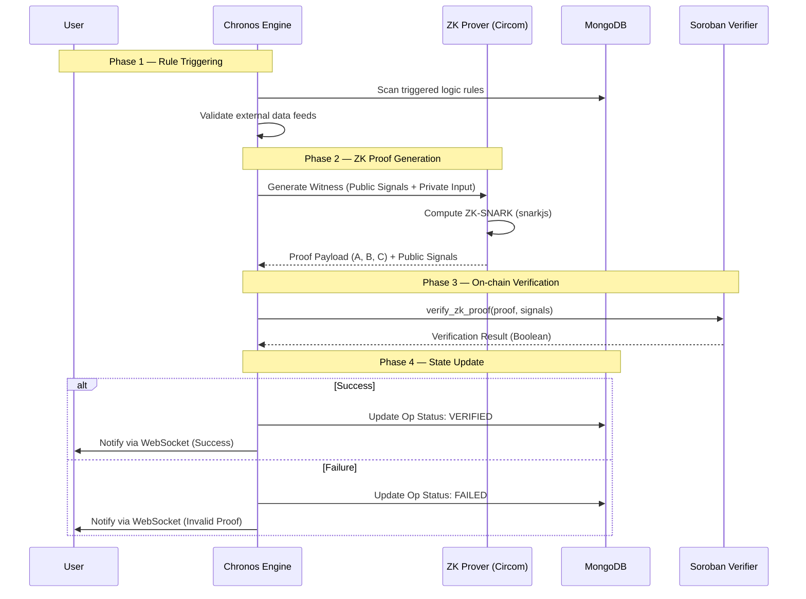
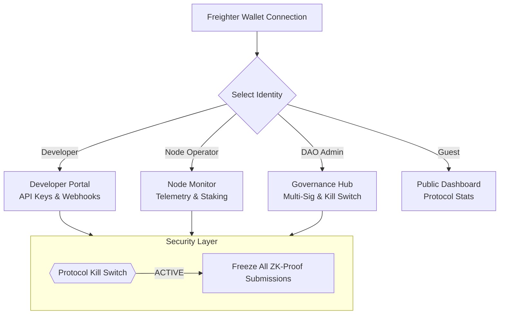
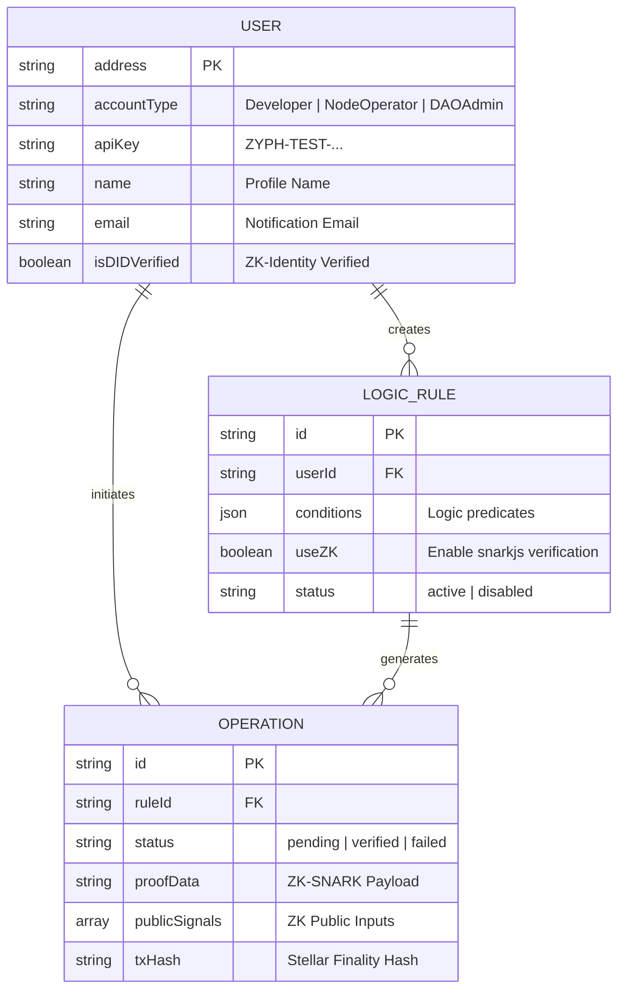
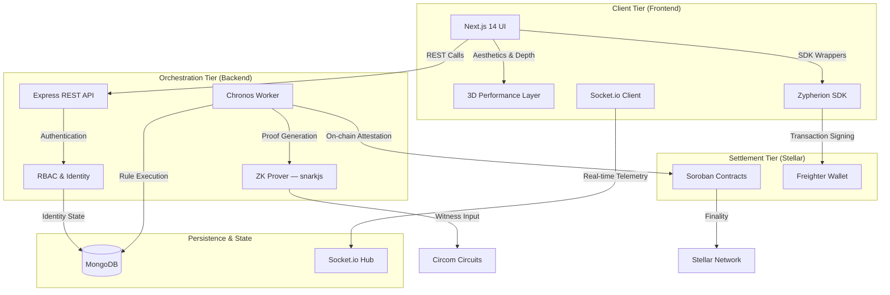
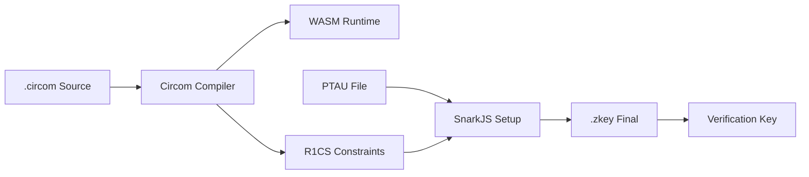

# Zypherion Protocol: System Architecture

This document provides a detailed visual representation and technical breakdown of the Zypherion Protocol's architecture, logic flows, and security models, now enhanced with Zero-Knowledge (ZK) proof capabilities and identity-centric governance.

---

## 1. High-Level System Architecture

This diagram shows the structural relationship between the protocol layers, including the new **ZK Prover Engine** and **Identity-Based Redirection**.

---

## 2. ZK-Proof Generation & Verification Flow

This sequence diagram illustrates the lifecycle of a Zero-Knowledge verified operation — from rule triggering to cryptographic finality.

---

## 3. Governance & RBAC Model

The protocol utilizes an Identity-Based Access Control (RBAC) model to ensure specialized tooling for different ecosystem participants.

---

## 4. Enhanced Database Schema

The MongoDB models now support profile metadata, API credentials, and ZK-specific operation fields.

---

## 5. Component Dependency Map

This diagram visualizes the interconnected nature of the Zypherion ecosystem, illustrating how data and logic flow between the client, orchestration, and settlement tiers.

---

## 6. ZK-Compilation Workflow

To maintain cryptographic sovereignty, the protocol requires a local compilation of Circom circuits. The build process transforms human-readable `.circom` logic into machine-executable `.wasm` and `.zkey` artifacts.

> [!TIP]
> Use the provided `circuits/compile_zk.sh` script to automate this entire pipeline.

---

## 7. 3D Sovereign Interface Layer

The frontend utilizes a custom **3D Performance Layer** to provide an immersive administrative experience without the overhead of heavy WebGL libraries.

- **Hardware Acceleration**: Uses CSS `perspective` and `transform-style: preserve-3d` for GPU-accelerated rendering.
- **Dynamic Assets**: Rotating wireframe octahedrons and orbiting data particles that respond to system state.
- **Tactile UI**: Integrated SVG noise filters and radial gradients create a premium, high-fidelity aesthetic.

---

### Technology Stack Summary

| Layer | Core Technologies |
| :--- | :--- |
| **Frontend** | Next.js 14, Framer Motion, TailwindCSS |
| **Backend** | Node.js, Express, snarkjs, Circom 2.1 |
| **Database** | MongoDB (Persistence), Redis (Optional/Caching) |
| **Smart Contracts** | Rust (Soroban SDK), ZK-Verifier |
| **Identity** | Stellar Freighter, ZK-Identity Protocol |

___
> [!IMPORTANT]
> The ZK Prover Engine currently supports Groth16 proofs generated via Circom circuits. The **Batch Aggregator** module enables the protocol to combine multiple state transitions into a single on-chain verification, significantly reducing gas costs.
