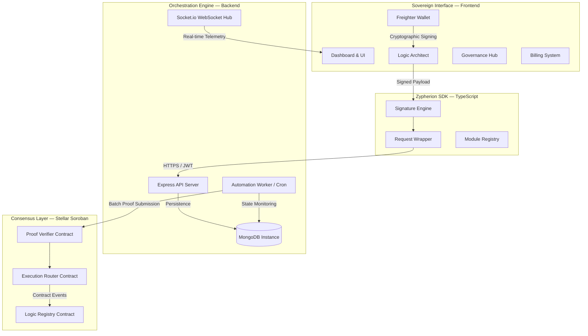
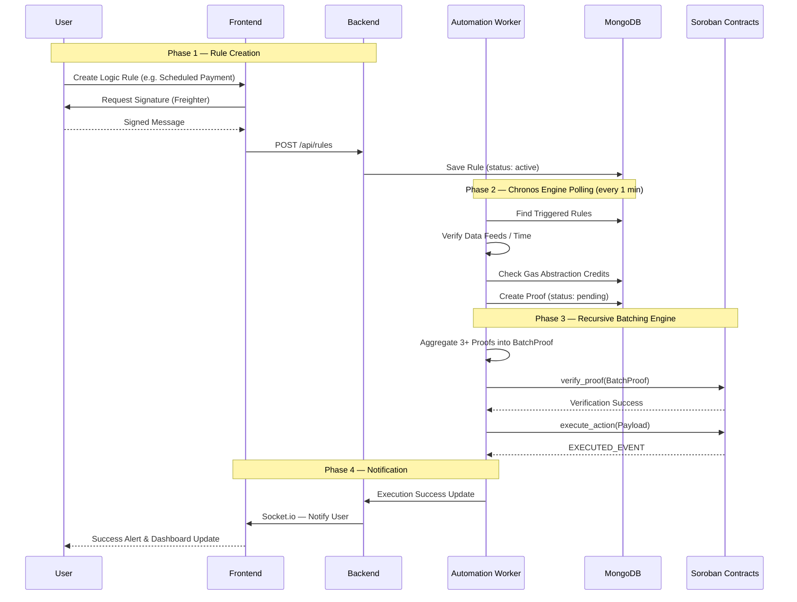
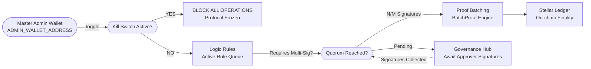
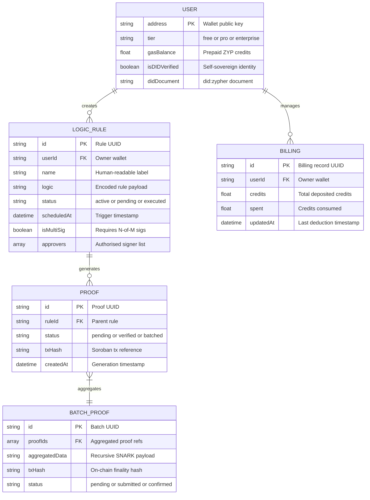
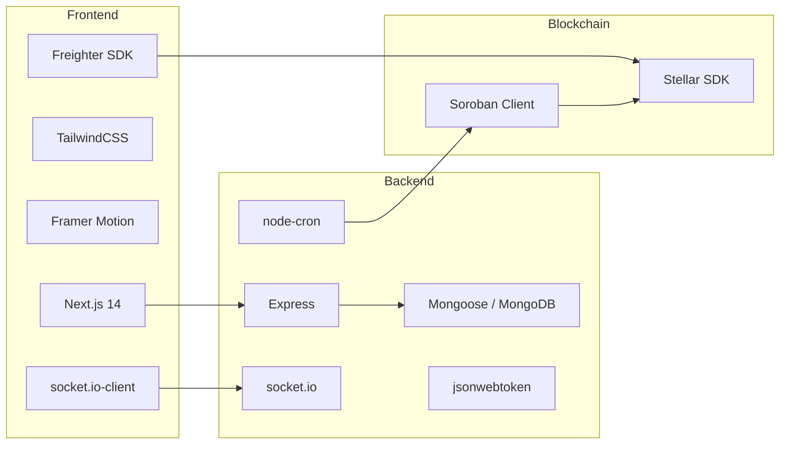

# Zypherion Protocol: System Architecture

This document provides a detailed visual representation and technical breakdown of the Zypherion Protocol's architecture, logic flows, and security models.

---

## 1. High-Level System Architecture

This diagram shows the structural relationship between the four primary layers of the protocol: the Sovereign Interface, the SDK, the Orchestration Engine, and the Consensus Layer.

---

## 2. Logic Execution & Batching Flow

This sequence diagram illustrates the full lifecycle of an automated rule — from user definition through recursive proof batching to on-chain finality.

---

## 3. Governance & Security Model

The protocol utilizes a multi-layered security model to ensure trustless execution and sovereign control over automation rules.

---

## 4. Database Schema Relationships

A high-level entity-relationship view of how the MongoDB models are interconnected across the protocol.

---

## 5. Component Dependency Map

This map outlines the core technologies and dependencies used across each layer of the stack.

