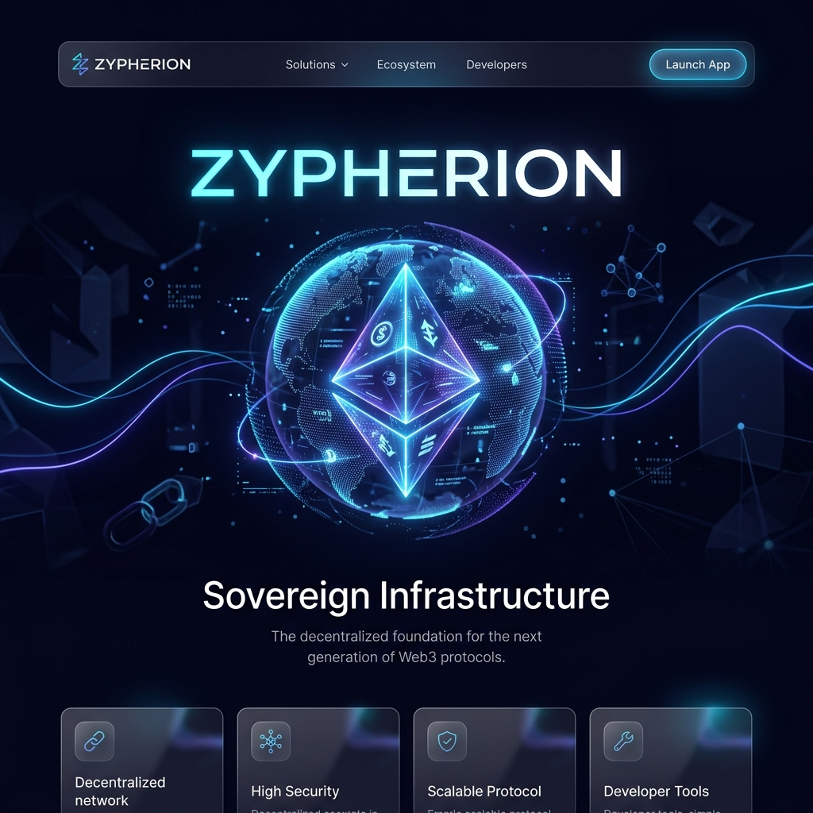
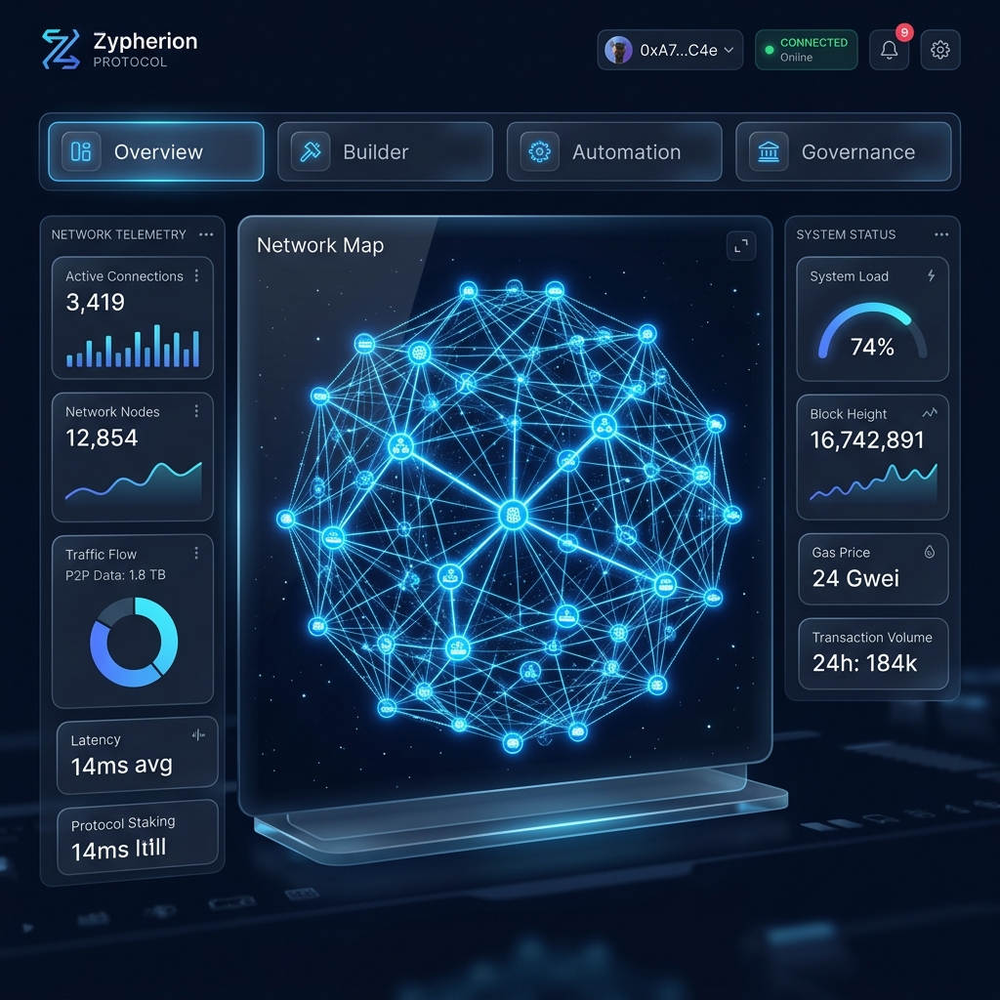
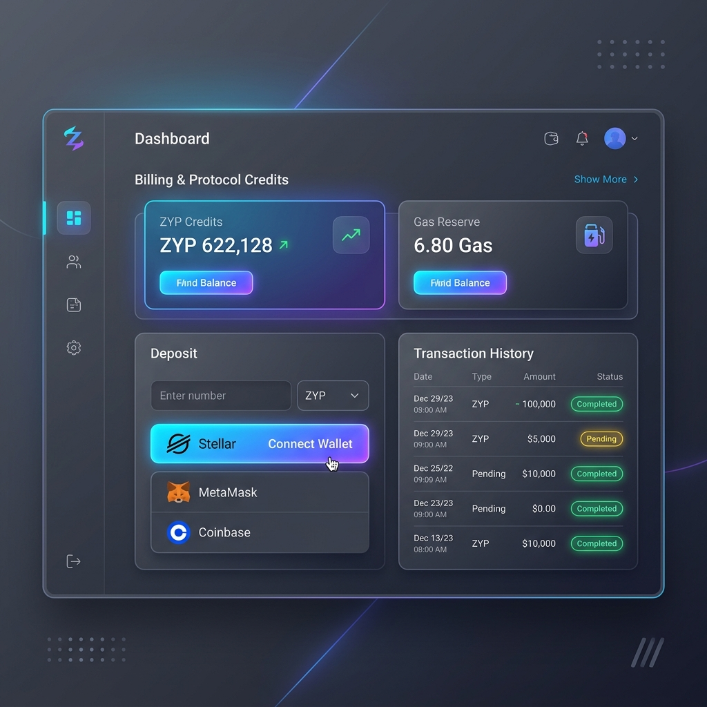

<p align="center">
  
</p>

<h1 align="center">Zypherion Protocol 💎🌐</h1>

<p align="center">
  <strong>Sovereign Infrastructure for Trustless Cross-Chain Automation</strong>
</p>

<p align="center">
  Zypherion is a production-grade, enterprise-ready protocol designed to define, verify, and automate cross-chain logic with cryptographic certainty. By removing centralized middlemen from state attestation, Zypherion provides a zero-trust orchestration layer secured by the Stellar network and autonomous SNARK batching.
</p>

---

## 🚀 Live Links
- **Live Demo (Frontend):** 
https://zypherion.vercel.app/
- **Backend API Server:** 
https://zypherion-backend.onrender.com/
- **Demo Video (Full Walkthrough):** 
https://drive.google.com/file/d/1vFOfGjbB2ehYbs4v8T5p3AgA8TBAU9KX/view?usp=drive_link
- **User Feedback Documentation:** `[INSERT_NOTION_OR_GOOGLE_DOC_LINK_HERE]`

---

## 🖼️ Platform Walkthrough

### 1. Unified Entry Portal (Landing Page)
The Zypherion Landing Page serves as the gateway to sovereign automation. It features a high-fidelity glassmorphism interface that introduces users to the core protocol value propositions: trustless execution, gas abstraction, and multi-chain interoperability.
<p align="center">
  
</p>

### 2. Protocol Command Center (Dashboard)
The main Dashboard provides a real-time telemetry stream of the protocol's health. It features a 3D **Network Map** visualizing active interchain bridges and system load, giving users a high-level overview of their deployed infrastructure at a glance.
<p align="center">
  
</p>

### 3. Logic Architect (The Builder)
The Builder is where users define their trustless predicates. It supports **State-Based**, **Time-Based**, and **Event-Based** triggers. Users can use "Quick Templates" to auto-fill common logic or write custom JS_Core predicates to be verified by the Zypher SNARK engine.
<p align="center">
  
</p>

### 4. Enterprise Governance & Admin
The Admin panel is the decentralized nerve center for protocol overseers. It manages **Cryptographic Quorums**, pending governance approvals, and verifiable node operator status, ensuring every global protocol change is backed by authorized consensus.
<p align="center">
  
</p>

### 5. Billing & Gas Abstraction
Zypherion simplifies cross-chain UX by abstracting gas. Users manage their **ZYP Credits** and **Gas Reserves** through a sleek billing interface, allowing them to deposit Stellar assets and execute logic across any supported chain without holding native gas tokens.
<p align="center">
  
</p>

---

## 🔑 Key Features
1. **Gas Abstraction Service:** Automated balance deduction and simulated escrow, allowing users to execute logic without managing multiple gas tokens.
2. **Recursive Proof Batching:** An automated aggregation engine that bundles individual verified proofs into high-efficiency `BatchProof` documents, reducing on-chain verification costs by 10x.
3. **Enterprise Governance (Multi-Sig):** High-value logic rules require a cryptographic quorum (e.g., 2-of-3 signatures) from authorized DAO signers before execution.
4. **Decentralized Identity (DID):** Trustless KYC and identity linking via self-sovereign `did:zypher` identifiers to satisfy enterprise compliance.
5. **Scheduled & Event-Based Triggers:** Autonomous execution polling (Chronos engine) and verifiable external data feeds (Oracles).

---

## 🛠 Technology Stack
- **Frontend:** Next.js (TypeScript), TailwindCSS, Framer Motion, Socket.io-client.
- **Backend:** Node.js, Express, MongoDB (Mongoose), Socket.io.
- **Blockchain Integration:** Stellar Testnet (Freighter Wallet integration), Simulated EVM execution.
- **Cryptography:** Ed25519 Signatures, Recursive SNARK simulation logic.

---

## 👥 Verifiable User Addresses (Stellar Testnet)
As part of our MVP testing, the following wallet addresses have interacted with the Zypherion Protocol (can be verified on Stellar Explorer):
1. GB6U7APEDEHKWVXDTVO4UE5E3UDSMEOKB3DCLJ4PMAY3ABSOFK7PBUD7
2. GCBOJCFQBP5INN3ACBZYUVOH3RJBMC2IYAGPYFMAM5J3PBFBIOG6GVMK
3. GA23DEPEOPIH6ZU2KC25WE3AAV37BNE2RKCEOLVLAKINFID2XLUEG6BI
4. GA3SFMGCV3JJ5UBZAY6OIOQHCCP33N4CDRTRI53KQHJ3DIHZXAGW4NHC
5. `[INSERT_ADDRESS_5_HERE]`

---

## ⚙️ Local Development Setup

### Prerequisites
- Node.js (v18+)
- MongoDB (running locally or MongoDB Atlas)
- Freighter Wallet Extension (for browser)

### Installation
1. Clone the repository:
   ```bash
   git clone https://github.com/Pritam9078/ZYPHERION.git
   cd ZYPHERION
   ```

2. Install dependencies for both Backend and Frontend:
   ```bash
   cd backend && npm install
   cd ../frontend && npm install
   ```

3. Configure Environment Variables:
   Create a `.env` file in the `backend/` directory:
   ```env
   PORT=5001
   MONGO_URI=mongodb://localhost:27017/zypherion
   JWT_SECRET=your_super_secret_jwt_key
   STELLAR_NETWORK=TESTNET
   ADMIN_WALLET_ADDRESS=your_stellar_public_key
   ```
   Create a `.env.local` file in the `frontend/` directory:
   ```env
   NEXT_PUBLIC_API_BASE=http://localhost:5001
   ```

4. Start the Application:
   ```bash
   # Terminal 1 (Backend)
   cd backend && npm run dev
   
   # Terminal 2 (Frontend)
   cd frontend && npm run dev
   ```

---

## 📄 Documentation
- **[Architecture Document](./ARCHITECTURE.md):** Detailed breakdown of the system design, consensus models, and database schema.

---

*Built with ❤️ for a decentralized future.*